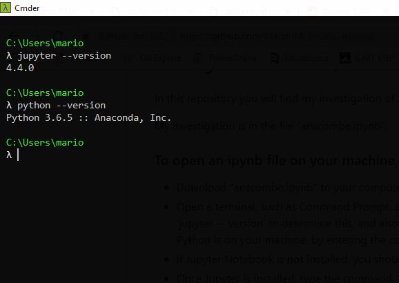

# Semester 2: Programming for Data Analysis
## Investigate the numpy.random package

In this repository you will find my investigation of the numpy.random package. The body of my work in contained in the Jupyter notebook numpy-random.ipynb; including all code, explanations and references. 

In this file you will find:
1. Information on how to download and save the numpy-random.ipynb notebook.
2. Instructions on how to open the notebook on your machine.
3. How to run code cells in an open ipynb notebook.
4. My approach to this assignment, and evaluation of it's success.
5. Areas of Difficulty.
6. A note on my References.

### 1. Downloading an ipynb file from Github
* Click to open the file "numpy-random.ipynb" above.
* Right click on Raw, and select Save link as
* Choose the directory you want to save the file to. You may change the name of the file but keep the extension as .ipynb.

### 2. Opening an ipynb file on your machine
* Open a terminal, such as Command Prompt. I will be using [Cmdr.exe](http://cmder.net/), but it doesn't matter which command line interpreter you use. 
* First, check if Jupyter is installed on your machine. Type the command, 'jupyter -- version' to determine this, and also to see which version is installed on your machine. You should also ensure Python is on your machine, by entering the command 'python --version'.

* If Jupyter Notebook is **not** installed, you should download [Anaconda](https://www.anaconda.com/download/) which supports Jupyter notebook files, and Python code. 
* Once Jupyter is installed, type the command, 'jupyter notebook' to open a static webpage displaying the folder you're currently in. You may need to copy and paste the URL (highlighted below) that appears on the command line, if a webpage doesn't automatically open. 

**NOTE:** When opening Jupyter notebook, ensure your downloaded ipynb file is in a subdirectory of the folder you are in. You may use the cd/ command to go to the top of your directory, to ensure this is the case. Alternatively if you're familiar with commands, you may use the 'cd' command to navigate to the directory containing your notebook.
* From the webpage, navigate to the folder containing your ipynb file and click to open in a new tab. 
* When you are finished, go to the taskbar tab, File and choose Close and Halt. Close all windows. In your terminal, to close Jupyter Notebook press Ctrl+C.

### 3. Running code from an ipynb file
Firstly as much of the code in this notebook is dependent on variables in previous cells, I would advise running all cells at the beginning. To do this, go to taskbar button Cell, and select Run All from the drop down menu. 

To run an individual code cell, you first need to be in command mode. In this mode there will be a blue line to the left of the cell. If you have selected a cell, but the line on the left is not blue, press Esc. 

Once in command mode, you can navigate up and down the notebook using arrow keys. 

You can also run an individual cell, by pressing Shift+p.

### 4. Appproach and Evaluation 
My approach was to work my way through each of the functions and classes included in the numpy.random package. I planned to:
* Examine all or most of the random number generators, listed under the heading Simple Random Data
* Examine a function which could be used for sampling datasets.
* Examine functions which could be used to shuffle variables, listed under the heading Permutations. 
* Examine five distribution
  1. Uniform
  2. Normal
  3. Binomial
  4. Poisson
  5. Exponential
* Investigate tools for seeding random number generators

**Evaluation**
* My focus on generating sets of random numbers, meant I didn't immediately make the connection between the distributions and their probabilities. In my investigation of the Binomial distribution, I began my investigation with a probability experiment, as that's how I'm most familiar with that distribution. Similarly I immediately related the Normal Distribution to the Empirical Rule. But I didn't make the connection between the other distributions and their real world application, until after the Skype call with our lecturer, Ian McLoughlin. This highlighted how narrow my approach had originally been. 
* Importing Libraries - Given the amount I've using numpy.random, I should have imported as random, or a suitable acronym. I did need the whole numpy package as I used it to sum and round values as well, but in the interests of efficiency I would import my libraries differently in futre. 

### 5. Areas of Difficulty
* Shuffle() - I encountered difficulty in my investigations of shuffle() and it's differences when compared to permutation(). This arose as I misunderstood what the documentation meant when it said that the function shuffled the data in place. As a result, attempts to output shuffle(), returned None. 
* Poisson and Exponential Distributions - I struggled with the documentation for these two distributions and how they relate to one another. Particularly, how to identify the rate and scale parameters in a real world example. I think I got there in the end, but there is not a lot of examples that would be easily accessible for beginners. 
* I wasn't able to get a Jupyter extension for spelling and grammar errors up and running. Given time constraints I didn't try this more than once, so apologies for all the spelling mistakes.

### 6. A note on References
* In my notebook, I have referenced websites and documentation accessed during the course of this assignment. 
* Due to my own background in Mathematics, there are not many references for a number of the distributions examined. This is because I already have experience with the Normal and Binomial distributions, and relied on my own understanding. So all errors are my own.
* Leaving Cert and A Level Maths books consulted during the investigation are not included in my references.
